# Open5GS 5G Core Network with Roaming Support

A comprehensive deployment solution for Open5GS 5G Core Network with complete roaming capabilities using Docker and Kubernetes (MicroK8s). This project provides automated deployment, management tools, and production-ready configurations for both HPLMN (Home Network) and VPLMN (Visited Network) scenarios.

## 🚀 Quick Start

```bash
# Clone the repository
git clone https://github.com/roastedbeans05/open5gs-roaming.git
cd open5gs-roaming

# Make CLI executable
chmod +x cli.sh

# Complete automated setup (15-20 minutes)
./cli.sh setup-roaming --full-setup
./cli.sh deploy-roaming

# Add test subscribers
./cli.sh subscribers --add-range --start-imsi 001011234567891 --end-imsi 001011234567900
```

## 📋 Documentation Structure

This project documentation is organized into focused guides:

| Document | Purpose | Best For |
|----------|---------|----------|
| **[📖 SETUP.md](docs/SETUP.md)** | Complete setup guide with 3 approaches | All users - choose your preferred method |
| **[🐳 DOCKER.md](docs/DOCKER.md)** | Docker building and registry management | Building custom images |
| **[☸️ KUBERNETES.md](docs/KUBERNETES.md)** | Kubernetes deployment and configuration | K8s deployment and operations |
| **[🛠️ SCRIPTS.md](docs/SCRIPTS.md)** | CLI and script documentation | Understanding automation tools |
| **[🔧 TROUBLESHOOTING.md](docs/TROUBLESHOOTING.md)** | Problem solving and verification | Debugging and maintenance |

## 🏗️ Open5GS Overview

### Architecture

This project implements a complete 5G roaming scenario with two separate networks:

```mermaid
graph TB
    subgraph "HPLMN (Home Network) - MCC: 001, MNC: 01"
        subgraph "hplmn namespace"
            H_NRF[NRF - Service Registry]
            H_UDR[UDR - User Data Repository]
            H_UDM[UDM - User Data Management]
            H_AUSF[AUSF - Authentication]
            H_SCP[SCP - Service Communication]
            H_SEPP[SEPP - Security Edge]
            H_MONGO[(MongoDB)]
        end
    end
    
    subgraph "VPLMN (Visited Network) - MCC: 999, MNC: 70"
        subgraph "vplmn namespace"
            V_NRF[NRF - Service Registry]
            V_UDR[UDR - User Data Repository]
            V_UDM[UDM - User Data Management]
            V_AUSF[AUSF - Authentication]
            V_PCF[PCF - Policy Control]
            V_BSF[BSF - Binding Support]
            V_NSSF[NSSF - Network Slice Selection]
            V_SCP[SCP - Service Communication]
            V_SEPP[SEPP - Security Edge]
            V_SMF[SMF - Session Management]
            V_UPF[UPF - User Plane Function]
            V_AMF[AMF - Access & Mobility Management]
        end
    end
    
    subgraph "Security & DNS"
        TLS[TLS Certificates N32]
        DNS[CoreDNS 3GPP Rewrite Rules]
    end
    
    H_SEPP <-->|N32 Roaming Interface| V_SEPP
    H_UDR --> H_UDM
    H_UDM --> H_AUSF
    V_AMF --> V_SMF
    V_SMF --> V_UPF
    DNS --> H_NRF
    DNS --> V_NRF
    TLS --> H_SEPP
    TLS --> V_SEPP
```



### Key Features

- **Complete 5G Core**: All network functions (AMF, SMF, UPF, NRF, etc.)
- **Roaming Support**: Inter-PLMN communication via SEPP N32 interface
- **Container-Native**: Docker and Kubernetes ready
- **Production-Ready**: TLS encryption, persistent storage, monitoring
- **Automated Deployment**: CLI-driven setup and management
- **Subscriber Management**: Bulk subscriber operations
- **External Database Access**: MongoDB external connectivity

### Network Configuration

| Network | MCC | MNC | PLMN ID | Use Case |
|---------|-----|-----|---------|----------|
| HPLMN   | 001 | 01  | 00101   | Home Network (Subscriber's home operator) |
| VPLMN   | 999 | 70  | 99970   | Visited Network (Roaming partner) |

## 📁 Project Structure

```
open5gs-roaming/
├── README.md                     # This overview document
├── docs/                         # Detailed documentation
│   ├── SETUP.md                 # Setup guide (3 approaches)
│   ├── DOCKER.md                # Docker guide
│   ├── KUBERNETES.md            # Kubernetes guide  
│   ├── SCRIPTS.md               # Scripts and CLI guide
│   └── TROUBLESHOOTING.md       # Troubleshooting guide
├── cli.sh                       # Main CLI interface
├── scripts/                     # All automation scripts
└── k8s-roaming/                 # Kubernetes manifests
    ├── hplmn/                   # Home Network configs
    └── vplmn/                   # Visited Network configs
```

## 🎯 Choose Your Path

### 🆕 New to 5G/Open5GS?
→ Start with **[SETUP.md → Option A: Fully Automated](docs/SETUP.md#-option-a-fully-automated-setup)**

### 🎓 Want to Learn the Process?
→ Follow **[SETUP.md → Option B: Semi-Automated](docs/SETUP.md#-option-b-semi-automated-setup-cli-guided)**

### 🔧 Need Full Control?
→ Use **[SETUP.md → Option C: Manual](docs/SETUP.md#-option-c-manual-setup-complete-control)**

### 🐳 Building Custom Images?
→ See **[DOCKER.md](docs/DOCKER.md)** for complete Docker workflow

### ☸️ Kubernetes Expert?
→ Jump to **[KUBERNETES.md](docs/KUBERNETES.md)** for deployment details

### 🛠️ Want to Understand Scripts?
→ Review **[SCRIPTS.md](docs/SCRIPTS.md)** for automation details

### 🔧 Having Issues?
→ Check **[TROUBLESHOOTING.md](docs/TROUBLESHOOTING.md)** for solutions

## 🎛️ Common Commands

```bash
# View all CLI options
./cli.sh help

# Check system status
microk8s kubectl get pods -n hplmn
microk8s kubectl get pods -n vplmn

# Monitor MongoDB
./cli.sh mongodb-access --status

# Manage subscribers
./cli.sh subscribers --count-subscribers
./cli.sh subscribers --add-single --imsi 001011234567891

# Clean up
./cli.sh clean-k8s -n hplmn
./cli.sh clean-docker
```

## 📋 Prerequisites

- **OS**: Ubuntu 22.04 LTS (recommended)
- **Memory**: Minimum 8GB RAM (16GB recommended)
- **Storage**: Minimum 50GB available space
- **CPU**: Minimum 4 cores (8 cores recommended)
- **Network**: Internet connectivity for image pulls

## 🤝 Contributing

1. Fork the repository
2. Create your feature branch (`git checkout -b feature/amazing-feature`)
3. Commit your changes (`git commit -m 'Add some amazing feature'`)
4. Push to the branch (`git push origin feature/amazing-feature`)
5. Open a Pull Request

## 📄 License

This project is licensed under the Apache License 2.0. See the [LICENSE](LICENSE) file for details.

## 🆘 Support

- 📖 **Documentation**: Check the appropriate guide in `docs/`
- 🐛 **Issues**: Create an issue in the GitHub repository
- 💬 **Discussions**: Use GitHub Discussions for questions
- 📧 **Contact**: [Your contact information]

## 📚 Additional Resources

- [Open5GS Official Documentation](https://open5gs.org/open5gs/docs/)
- [Docker Open5gs Github](https://github.com/Borjis131/docker-open5gs)
- [MicroK8s Documentation](https://microk8s.io/docs)
- [3GPP Specifications](https://www.3gpp.org/specifications)

---

**Note**: This setup provides a complete 5G Core Network with roaming capabilities for testing and development purposes. For production deployments, additional security hardening, performance optimization, and monitoring should be implemented.