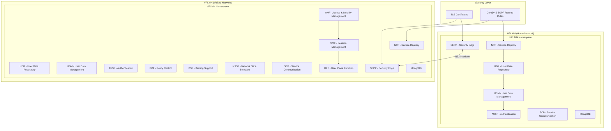
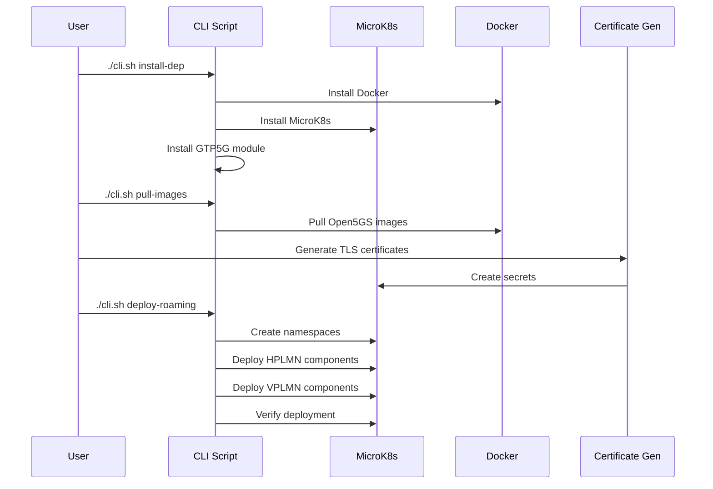

# Open5GS Roaming Docker and Kubernetes Setup

A comprehensive guide for deploying Open5GS 5G Core Network with roaming capabilities using Docker and Kubernetes (MicroK8s).

## 🏗️ System Architecture



## 📋 Prerequisites

### System Requirements
- **OS**: Ubuntu 22.04 LTS (recommended)
- **Memory**: Minimum 8GB RAM
- **Storage**: Minimum 50GB available space
- **CPU**: Minimum 2 cores
- **Network**: Internet connectivity for pulling images

### Required Software
- Docker CE
- MicroK8s (for Kubernetes deployment)
- Git
- OpenSSL (for certificate generation)
- GTP5G kernel module (for 5G support)

## 📁 Project Structure

```
open5gs-roaming/
├── cli.sh                      # Main CLI interface
├── README.md                   # This guide
├── k8s-roaming/               # Kubernetes manifests
│   ├── hplmn/                 # HPLMN network components
│   ├── vplmn/                 # VPLMN network components
│   └── pcap-logs/             # Packet capture configuration
└── scripts/                   # Organized deployment scripts
    ├── install-dep.sh         # Dependency installation
    ├── setup-k8s-roaming.sh   # Complete automated setup
    ├── deployment/            # Deployment scripts
    │   ├── kubectl-deploy-hplmn.sh
    │   ├── kubectl-deploy-vplmn.sh
    │   └── docker-deploy.sh
    ├── images/                # Image management
    │   ├── pull-docker-images.sh
    │   ├── import.sh
    │   └── update.sh
    ├── certificates/          # Certificate management
    │   ├── cert-deploy.sh
    │   ├── generate-sepp-certs.sh
    │   └── open5gs_tls/       # Generated certificates
    ├── database/              # Database management
    │   ├── mongodb-hplmn.sh
    │   └── mongodb44-setup.sh
    └── cleanup/               # Cleanup utilities
        ├── microk8s-clean.sh
        └── docker-clean.sh
```

## 🚀 Quick Start

### Step 1: Clone and Setup Repository

```bash
git clone https://github.com/roastedbeans05/open5gs-roaming.git
cd open5gs-roaming

# Make CLI executable
chmod +x cli.sh

# View available commands
./cli.sh help
```

### Step 2: Install Dependencies

```bash
./cli.sh install-dep
```

**Important**: After dependency installation, you must log out and log back in for Docker group permissions to take effect.

### Step 3: Choose Your Deployment Method

- **Option A**: [Quick Kubernetes Setup](#option-a-kubernetes-deployment-recommended) - Complete automated setup
- **Option B**: [Docker Deployment](#option-b-docker-deployment) - Manual Docker approach

---

## 🎯 Option A: Kubernetes Deployment (Recommended)

### Step 1: Install and Configure MicroK8s

```bash
# Install MicroK8s
sudo snap install microk8s --classic --channel=1.28/stable

# Add user to microk8s group
sudo usermod -aG microk8s $USER

# Create .kube directory
mkdir -p ~/.kube
sudo chown -f -R $USER ~/.kube

# Log out and back in, then check status
microk8s status --wait-ready

# Enable required addons
microk8s enable dns storage helm3
```

### Step 2: Configure CoreDNS for 3GPP Network Names

```bash
# Access MicroK8s dashboard
microk8s dashboard-proxy

# Or manually edit CoreDNS configuration
microk8s kubectl edit configmap coredns -n kube-system
```

Add the following rewrite rules to the Corefile section:

```yaml
Corefile: |
  .:53 {
    errors
    health {
      lameduck 5s
    }
    ready
    # HPLMN rewrite rules (mnc001.mcc001)
    rewrite name nrf.5gc.mnc001.mcc001.3gppnetwork.org nrf.hplmn.svc.cluster.local
    rewrite name scp.5gc.mnc001.mcc001.3gppnetwork.org scp.hplmn.svc.cluster.local
    rewrite name udr.5gc.mnc001.mcc001.3gppnetwork.org udr.hplmn.svc.cluster.local
    rewrite name udm.5gc.mnc001.mcc001.3gppnetwork.org udm.hplmn.svc.cluster.local
    rewrite name ausf.5gc.mnc001.mcc001.3gppnetwork.org ausf.hplmn.svc.cluster.local
    rewrite name sepp.5gc.mnc001.mcc001.3gppnetwork.org sepp.hplmn.svc.cluster.local
    rewrite name sepp1.5gc.mnc001.mcc001.3gppnetwork.org sepp-n32c.hplmn.svc.cluster.local
    rewrite name sepp2.5gc.mnc001.mcc001.3gppnetwork.org sepp-n32f.hplmn.svc.cluster.local
    
    # VPLMN rewrite rules (mnc070.mcc999)
    rewrite name nrf.5gc.mnc070.mcc999.3gppnetwork.org nrf.vplmn.svc.cluster.local
    rewrite name scp.5gc.mnc070.mcc999.3gppnetwork.org scp.vplmn.svc.cluster.local
    rewrite name udr.5gc.mnc070.mcc999.3gppnetwork.org udr.vplmn.svc.cluster.local
    rewrite name udm.5gc.mnc070.mcc999.3gppnetwork.org udm.vplmn.svc.cluster.local
    rewrite name pcf.5gc.mnc070.mcc999.3gppnetwork.org pcf.vplmn.svc.cluster.local
    rewrite name upf.5gc.mnc070.mcc999.3gppnetwork.org upf.vplmn.svc.cluster.local
    rewrite name smf.5gc.mnc070.mcc999.3gppnetwork.org smf.vplmn.svc.cluster.local
    rewrite name amf.5gc.mnc070.mcc999.3gppnetwork.org amf.vplmn.svc.cluster.local
    rewrite name bsf.5gc.mnc070.mcc999.3gppnetwork.org bsf.vplmn.svc.cluster.local
    rewrite name nssf.5gc.mnc070.mcc999.3gppnetwork.org nssf.vplmn.svc.cluster.local
    rewrite name ausf.5gc.mnc070.mcc999.3gppnetwork.org ausf.vplmn.svc.cluster.local
    rewrite name sepp.5gc.mnc070.mcc999.3gppnetwork.org sepp.vplmn.svc.cluster.local
    rewrite name sepp1.5gc.mnc070.mcc999.3gppnetwork.org sepp-n32c.vplmn.svc.cluster.local
    rewrite name sepp2.5gc.mnc070.mcc999.3gppnetwork.org sepp-n32f.vplmn.svc.cluster.local
    
    kubernetes cluster.local in-addr.arpa ip6.arpa {
      pods insecure
      fallthrough in-addr.arpa ip6.arpa
      ttl 30
    }
    prometheus :9153
    forward . /etc/resolv.conf {
      max_concurrent 1000
    }
    cache 30
    loop
    reload
    loadbalance
  }
```

### Step 3: Pull Docker Images

```bash
./cli.sh pull-images -t v2.7.5
```

### Step 4: Generate TLS Certificates

```bash
# Generate certificates for SEPP N32 interfaces
cd scripts/cert
chmod +x generate-sepp-certs.sh
./generate-sepp-certs.sh

# Deploy certificates as Kubernetes secrets
cd ../..
./cli.sh cert-deploy
```

### Step 5: Pull Docker Images

```bash
./cli.sh pull-images -t v2.7.5
```

### Step 6: Generate and Deploy TLS Certificates

```bash
# Generate certificates for SEPP N32 interfaces
./cli.sh generate-certs

# Deploy certificates as Kubernetes secrets
./cli.sh deploy-certs
```

### Step 7: Deploy Open5GS Components

Choose one of the following deployment options:

#### Option 7A: Complete Automated Setup

```bash
# Full automated setup (recommended for first-time users)
./cli.sh setup-roaming --full-setup
```

#### Option 7B: Deploy Individual Networks

```bash
# Deploy HPLMN components only
./cli.sh deploy-hplmn

# Deploy VPLMN components only
./cli.sh deploy-vplmn
```

#### Option 7C: Deploy Complete Roaming Setup

```bash
# Deploy both HPLMN and VPLMN together
./cli.sh deploy-roaming
```

### Step 8: Configure MongoDB for HPLMN

```bash
# Deploy MongoDB StatefulSet and Service for HPLMN
./cli.sh mongodb-hplmn

# Deploy with specific options
./cli.sh mongodb-hplmn --namespace hplmn --force

# Skip waiting for pods to be ready
./cli.sh mongodb-hplmn --no-wait
```

The MongoDB deployment includes:
- **StatefulSet**: For persistent MongoDB instances
- **Service**: For internal cluster access and optional NodePort
- **ConfigMap**: For MongoDB configuration (if present)
- **PVC/PV**: For persistent storage (if configured)
- **Connection Information**: Internal and external access details

### Step 7: Verify Deployment

```bash
# Check all pods are running
microk8s kubectl get pods -n hplmn
microk8s kubectl get pods -n vplmn

# Check services
microk8s kubectl get services -n hplmn -o wide
microk8s kubectl get services -n vplmn -o wide

# Check logs for any issues
microk8s kubectl logs -n hplmn deployment/nrf
microk8s kubectl logs -n vplmn deployment/amf
```

---

## 🐳 Option B: Docker Deployment

### Step 1: Build Open5GS Images

```bash
# Navigate to your Open5GS build directory
# Build all components using docker buildx bake
docker buildx bake
```

### Step 2: Deploy to Docker Compose

```bash
# If you have docker-compose files ready
docker compose up -d

# Or build and push to Docker Hub for sharing
./cli.sh docker-deploy -u your_dockerhub_username
```

---

## 🔧 Configuration and Management

### Deployment Flow Diagram



### CLI Command Reference

```bash
# 📦 Installation & Setup
./cli.sh install-dep           # Install dependencies (Docker, Git, GTP5G)
./cli.sh setup-roaming         # Complete automated setup

# 🚀 Deployment Commands
./cli.sh deploy-hplmn          # Deploy HPLMN only
./cli.sh deploy-vplmn          # Deploy VPLMN only  
./cli.sh deploy-roaming        # Deploy both networks
./cli.sh docker-deploy -u username    # Push images to Docker Hub

# 📦 Image Management
./cli.sh pull-images           # Pull all images from docker.io/vinch05
./cli.sh import-images         # Import images to MicroK8s registry
./cli.sh update-configs        # Update deployment configs for MicroK8s

# 🔐 Certificate Management
./cli.sh generate-certs        # Generate TLS certificates for SEPP
./cli.sh deploy-certs          # Deploy TLS certificates as K8s secrets

# 🗄️ Database Management
./cli.sh mongodb-hplmn         # Configure MongoDB for HPLMN
./cli.sh mongodb-install       # Install MongoDB 4.4 on host system

# 🧹 Cleanup Commands
./cli.sh clean-k8s -n hplmn    # Clean HPLMN namespace
./cli.sh clean-k8s -n vplmn    # Clean VPLMN namespace
./cli.sh clean-docker          # Clean Docker resources

# ℹ️ Information Commands
./cli.sh help                  # Show help message
./cli.sh version               # Show version information
```

### Command Options

```bash
# Common options for deployment commands
--namespace, -n   # Specify Kubernetes namespace (default: hplmn)
--tag, -t         # Specify image tag (default: v2.7.5)
--force, -f       # Skip confirmation prompts
--delete-pv       # Delete persistent volumes (with clean-k8s)

# Examples with options
./cli.sh pull-images -t v2.7.5
./cli.sh docker-deploy -u myusername -t v2.7.5
./cli.sh clean-k8s -n open5gs --delete-pv --force
./cli.sh setup-roaming --full-setup
```

### Network Configuration

#### HPLMN Network Identifiers
- **MCC**: 001 (Mobile Country Code)
- **MNC**: 001 (Mobile Network Code)
- **PLMN ID**: 00101

#### VPLMN Network Identifiers  
- **MCC**: 999 (Mobile Country Code)
- **MNC**: 070 (Mobile Network Code)
- **PLMN ID**: 99970

### Service Port Mapping

| Service | HPLMN Port | VPLMN Port | Protocol |
|---------|------------|------------|----------|
| NRF     | 7777       | 7777       | HTTP     |
| AMF     | -          | 7777       | HTTP     |
| SMF     | -          | 7777       | HTTP     |
| UDM     | 7777       | 7777       | HTTP     |
| UDR     | 7777       | 7777       | HTTP     |
| AUSF    | 7777       | 7777       | HTTP     |
| PCF     | -          | 7777       | HTTP     |
| SEPP    | 7777       | 7777       | HTTPS    |

---

## 📊 Monitoring and Verification

### Check Deployment Status

```bash
# View all cluster services with IPs
microk8s kubectl get services -n hplmn -o wide
microk8s kubectl get services -n vplmn -o wide

# Check pod status and logs
microk8s kubectl get pods -n hplmn
microk8s kubectl logs -f -n hplmn deployment/nrf

# Monitor resource usage
microk8s kubectl top pods -n hplmn
microk8s kubectl top pods -n vplmn
```

### Access MicroK8s Dashboard

```bash
# Start dashboard proxy
microk8s dashboard-proxy

# Open browser to: https://localhost:10443
# Use token provided by the command
```

### Verify 3GPP Network Name Resolution

```bash
# Test DNS resolution from within a pod
microk8s kubectl run -it --rm debug --image=nicolaka/netshoot -- bash

# Inside the pod, test resolution:
nslookup nrf.5gc.mnc001.mcc001.3gppnetwork.org
nslookup amf.5gc.mnc070.mcc999.3gppnetwork.org
```

---

## 🔍 Troubleshooting

### Common Issues and Solutions

#### 1. Pods Stuck in Pending State
```bash
# Check node resources
microk8s kubectl describe nodes

# Check if storage addon is enabled
microk8s status

# Enable storage if needed
microk8s enable storage
```

#### 2. Image Pull Errors
```bash
# Verify images are available
docker images | grep open5gs

# Re-pull images if needed
./cli.sh pull-images -t v2.7.5
```

#### 3. DNS Resolution Issues
```bash
# Check CoreDNS configuration
microk8s kubectl get configmap coredns -n kube-system -o yaml

# Restart CoreDNS pods
microk8s kubectl rollout restart deployment/coredns -n kube-system
```

#### 4. Certificate Issues
```bash
# Verify certificate secrets exist
microk8s kubectl get secrets -n hplmn
microk8s kubectl get secrets -n vplmn

# Regenerate certificates if needed
cd scripts/cert
./generate-sepp-certs.sh
../cli.sh cert-deploy
```

#### 5. Service Communication Issues
```bash
# Check service endpoints
microk8s kubectl get endpoints -n hplmn
microk8s kubectl get endpoints -n vplmn

# Test connectivity between services
microk8s kubectl exec -n hplmn deployment/nrf -- curl -v http://scp.hplmn.svc.cluster.local:7777
```

### Log Analysis

```bash
# View aggregated logs for troubleshooting
microk8s kubectl logs -n hplmn --selector=app=nrf --tail=100
microk8s kubectl logs -n vplmn --selector=app=amf --tail=100

# Follow logs in real-time
microk8s kubectl logs -f -n hplmn deployment/sepp
```

---

## 🧹 Cleanup and Maintenance

### Complete Environment Cleanup

```bash
# Clean specific namespaces
./cli.sh clean-k8s -n hplmn --force
./cli.sh clean-k8s -n vplmn --force

# Clean Docker resources
./cli.sh clean-docker --force

# Remove persistent volumes (if needed)
./cli.sh clean-k8s -n hplmn --delete-pv
```

### Maintenance Operations

```bash
# Update image tags in deployments
./cli.sh update-configs

# Import images to MicroK8s registry
./cli.sh import-images

# Restart deployments
microk8s kubectl rollout restart deployment -n hplmn
microk8s kubectl rollout restart deployment -n vplmn
```

---

## 📚 Additional Resources

### Script Organization

The project uses an organized script structure for better maintainability:

```
scripts/
├── cli.sh                      # Main unified interface
├── install-dep.sh              # System dependencies
├── setup-k8s-roaming.sh        # Complete setup orchestration
├── deployment/                 # Deployment-specific scripts
├── images/                     # Image management utilities  
├── certificates/               # TLS certificate handling
├── database/                   # Database configuration
└── cleanup/                    # Cleanup and maintenance
```

### Configuration Files Structure
```
k8s-roaming/
├── hplmn/              # HPLMN Kubernetes manifests
│   ├── nrf/
│   ├── scp/
│   ├── udr/
│   ├── udm/
│   ├── ausf/
│   ├── sepp/
│   └── mongodb/
├── vplmn/              # VPLMN Kubernetes manifests
│   ├── nrf/
│   ├── scp/
│   ├── udr/
│   ├── udm/
│   ├── ausf/
│   ├── pcf/
│   ├── bsf/
│   ├── nssf/
│   ├── sepp/
│   ├── smf/
│   ├── upf/
│   ├── amf/
│   └── mongodb/
└── pcap-logs/          # Packet capture configuration
```

### Certificate Structure
```
scripts/cert/open5gs_tls/
├── ca.crt                    # Certificate Authority
├── ca.key                    # CA Private Key
├── sepp-hplmn-n32c.crt      # HPLMN N32-C Certificate
├── sepp-hplmn-n32c.key      # HPLMN N32-C Private Key
├── sepp-hplmn-n32f.crt      # HPLMN N32-F Certificate
├── sepp-hplmn-n32f.key      # HPLMN N32-F Private Key
├── sepp-vplmn-n32c.crt      # VPLMN N32-C Certificate
├── sepp-vplmn-n32c.key      # VPLMN N32-C Private Key
├── sepp-vplmn-n32f.crt      # VPLMN N32-F Certificate
└── sepp-vplmn-n32f.key      # VPLMN N32-F Private Key
```

---

## 🤝 Contributing

1. Fork the repository
2. Create a feature branch
3. Make your changes
4. Test thoroughly
5. Submit a pull request

## 📄 License

This project is licensed under the Apache License 2.0. See the LICENSE file for details.

## 🆘 Support

For issues and questions:
- Create an issue in the GitHub repository
- Check the troubleshooting section above
- Review MicroK8s and Docker documentation

---

**Note**: This setup provides a complete 5G Core Network with roaming capabilities for testing and development purposes. For production deployments, additional security hardening and performance optimization should be implemented.