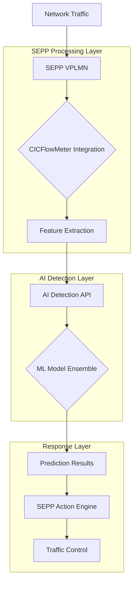

# AI Detection Process Flow: SEPP → VPLMN → AI Service

## Overview
This document outlines the comprehensive data flow from network traffic interception at the SEPP (Security Edge Protection Proxy) in the VPLMN (Visited Public Land Mobile Network) through AI-powered intrusion detection.

## Architecture Flow



## Detailed Process Flow

### 1. Network Traffic Ingress
**Source**: External network traffic entering VPLMN
**Protocol**: TCP/UDP packets, 5G network interfaces (N1, N2, N3, N32)
**Volume**: Real-time packet streams

### 2. SEPP Traffic Interception
**Component**: Security Edge Protection Proxy (SEPP)
**Function**:
- Packet capture and buffering
- Initial traffic analysis
- Suspicious pattern detection
- Packet forwarding to CICFlowMeter

**Configuration**:
```yaml
interfaces: ["n1", "n2", "n3", "n32"]
pcap:
  enabled: true
  interface: "eth0"
  filter: "tcp or udp"
```

### 3. CICFlowMeter Feature Extraction
**Component**: Network flow analyzer
**Input**: Raw packet data
**Process**:
- Flow aggregation (5-tuple: src_ip, dst_ip, src_port, dst_port, protocol)
- Statistical feature calculation
- Time-window analysis
- Feature vector generation (76 features)

**Output Format**:
```json
{
  "features": [0.123, 0.456, ..., 0.789],
  "metadata": {
    "flow_id": "192.168.1.1:1234->10.0.0.1:80",
    "timestamp": "2024-01-01T12:00:00Z",
    "protocol": "TCP"
  }
}
```

### 4. AI Detection API Ingestion
**Endpoint**: `POST /detect`
**Input**: Feature vector (76 float values)
**Validation**:
- Feature count verification (exactly 76)
- Data type validation (float array)
- Rate limiting (100 requests/minute)

**Request Format**:
```json
{
  "features": [float, float, ..., float], // 76 values
  "model_type": "ensemble" // optional: cnn, mlp, rnn, lstm, gru, autoencoder, ensemble
}
```

### 5. Machine Learning Model Processing
**Models Available**:
- **CNN**: Convolutional Neural Network (high accuracy, resource intensive)
- **MLP**: Multi-Layer Perceptron (efficient, balanced performance)
- **RNN**: Recurrent Neural Network (sequential patterns)
- **LSTM**: Long Short-Term Memory (complex sequences)
- **GRU**: Gated Recurrent Unit (memory efficient)
- **Autoencoder**: Unsupervised anomaly detection
- **Ensemble**: Combined prediction from all models

**Processing Pipeline**:
1. **Data Scaling**: StandardScaler normalization
2. **Model Inference**: PyTorch forward pass
3. **Ensemble Voting**: Majority voting across models
4. **Confidence Scoring**: Prediction probability calculation

### 6. Prediction Results Generation
**Output Format**:
```json
{
  "prediction": "normal|ddos|probe|tls",
  "confidence": 0.95,
  "model_used": "ensemble",
  "processing_time_ms": 15.7,
  "threat_level": "low|medium|high",
  "recommendations": ["allow", "monitor", "block"]
}
```

**Decision Logic**:
- **Confidence > 0.9**: High threat level → Block
- **Confidence 0.7-0.9**: Medium threat level → Monitor + Alert
- **Confidence 0.5-0.7**: Low threat level → Log only
- **Confidence < 0.5**: Normal traffic → Allow

### 7. SEPP Response Engine
**Actions Based on Results**:
- **Block**: Drop packets, update firewall rules
- **Monitor**: Increase logging, flag for review
- **Alert**: Send notifications to security team
- **Allow**: Continue normal processing

**Integration Points**:
- Open5GS API communication
- Firewall rule updates
- Logging system integration
- Dashboard alerts

### 8. Traffic Control & Logging
**Final Actions**:
- Traffic routing decisions
- Security event logging
- Performance metrics collection
- Audit trail maintenance

## Data Flow Summary

| Stage | Component | Input | Output | Latency |
|-------|-----------|-------|--------|---------|
| 1 | Network | Raw packets | - | - |
| 2 | SEPP | Packets | Filtered packets | <1ms |
| 3 | CICFlowMeter | Packets | 76-feature vector | 10-50ms |
| 4 | AI API | Feature vector | Prediction request | <1ms |
| 5 | ML Models | Normalized features | Raw predictions | 5-25ms |
| 6 | Ensemble Logic | Model predictions | Final result | <1ms |
| 7 | SEPP Response | AI results | Action commands | <1ms |
| 8 | Traffic Control | Commands | Policy enforcement | <1ms |

## Performance Characteristics

### Throughput (samples/second)
- **MLP/Autoencoder**: ~70K-77K
- **RNN/GRU**: ~4K-7K
- **CNN/LSTM**: ~1K-2K
- **Ensemble**: ~800 (bottlenecked by slowest model)

### Latency (end-to-end)
- **Fast models**: 15-50ms
- **Complex models**: 50-100ms
- **Ensemble**: 100-200ms

### Resource Usage
- **CPU**: 1-3 cores (depending on model)
- **Memory**: 256-512MB
- **Storage**: ~2.7GB (model weights + dependencies)

## Error Handling

### Failure Scenarios
1. **CICFlowMeter down**: Fallback to basic SEPP filtering
2. **AI service unavailable**: Allow traffic with warnings
3. **Model loading failure**: Use backup model or basic rules
4. **High latency**: Queue processing with backpressure

### Monitoring Points
- Packet drop rates
- False positive/negative rates
- Processing latency histograms
- Model accuracy drift detection

## Security Considerations

- **Data Privacy**: Feature vectors contain no sensitive payload data
- **Rate Limiting**: Prevents API abuse and DoS attacks
- **Authentication**: API key validation between SEPP and AI service
- **Encryption**: TLS 1.3 for all API communications
- **Audit Logging**: Complete trail of all decisions and actions

## Deployment Architecture

```
┌─────────────────┐    ┌─────────────────┐    ┌─────────────────┐
│   VPLMN Network │────│      SEPP       │────│  CICFlowMeter   │
│                 │    │  (Kubernetes)  │    │  (Sidecar/Daemon)│
└─────────────────┘    └─────────────────┘    └─────────────────┘
                                │                        │
                                ▼                        ▼
┌─────────────────┐    ┌─────────────────┐    ┌─────────────────┐
│  AI Detection   │◄───│   REST API      │◄───│ Feature Vector  │
│   Service       │    │   (HTTP/JSON)  │    │   (76 floats)   │
│  (Kubernetes)   │    └─────────────────┘    └─────────────────┘
└─────────────────┘             │
                                ▼
┌─────────────────┐    ┌─────────────────┐
│   Ensemble      │    │  Prediction     │
│   ML Models     │────│   Results       │
│                 │    │                 │
└─────────────────┘    └─────────────────┘
```

This process ensures comprehensive network security with AI-powered threat detection while maintaining high performance and low latency for legitimate traffic.
