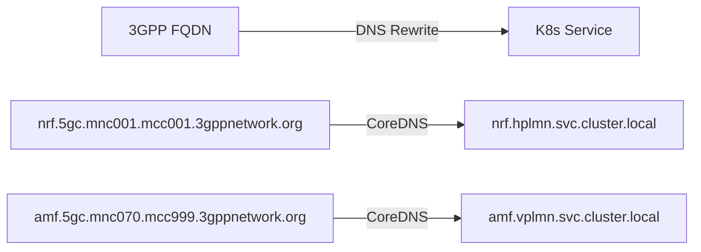
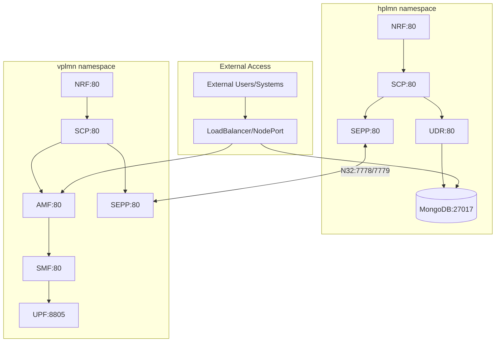

# Kubernetes Guide for Open5GS

This guide covers comprehensive Kubernetes deployment, configuration, and management of Open5GS 5G Core Network with roaming capabilities using MicroK8s.

## 📋 Table of Contents

- [MicroK8s Setup](#microk8s-setup)
- [CoreDNS Configuration](#coredns-configuration-for-3gpp-network-names)
- [Namespace Architecture](#namespace-architecture)
- [Service Configuration](#service-configuration)
- [Storage Management](#storage-management)
- [TLS and Security](#tls-and-security)
- [External Access](#external-access-configuration)
- [Scaling and Performance](#scaling-and-performance)

---

## ☸️ MicroK8s Setup

### Installation

```bash
# Install MicroK8s
sudo snap install microk8s --classic --channel=1.28/stable

# Add user to microk8s group
sudo usermod -aG microk8s $USER

# Setup kubectl directory
mkdir -p ~/.kube
sudo chown -f -R $USER ~/.kube

# Log out and back in, then check status
microk8s status --wait-ready
```

### Enable Required Addons

```bash
# Enable essential addons
microk8s enable dns storage helm3

# Verify addons are enabled
microk8s status

# Optional: Enable additional addons
microk8s enable dashboard        # Web dashboard
microk8s enable registry        # Local registry
microk8s enable ingress         # Ingress controller
microk8s enable metrics-server  # Resource metrics
```

### Verify Installation

```bash
# Check cluster status
microk8s kubectl cluster-info

# Verify nodes
microk8s kubectl get nodes -o wide

# Check system pods
microk8s kubectl get pods -n kube-system
```

---

## 🌐 CoreDNS Configuration for 3GPP Network Names

### Understanding 3GPP Network Naming

In 5G networks, services use specific FQDN patterns defined by 3GPP standards:

- **Format**: `service.5gc.mnc{MNC}.mcc{MCC}.3gppnetwork.org`
- **HPLMN Example**: `nrf.5gc.mnc001.mcc001.3gppnetwork.org`
- **VPLMN Example**: `nrf.5gc.mnc070.mcc999.3gppnetwork.org`

### Why DNS Rewrite Rules Are Needed

Since Kubernetes uses internal DNS names like `service.namespace.svc.cluster.local`, we need DNS rewrite rules to map 3GPP FQDNs to Kubernetes services.



### Configure CoreDNS

```bash
# Edit CoreDNS configuration
microk8s kubectl edit configmap coredns -n kube-system
```

Add these rewrite rules to the Corefile section:

```yaml
apiVersion: v1
kind: ConfigMap
metadata:
  name: coredns
  namespace: kube-system
data:
  Corefile: |
    .:53 {
      errors
      health {
        lameduck 5s
      }
      ready
      
      # HPLMN DNS Rewrite Rules (MNC: 001, MCC: 001)
      rewrite name nrf.5gc.mnc001.mcc001.3gppnetwork.org nrf.hplmn.svc.cluster.local
      rewrite name scp.5gc.mnc001.mcc001.3gppnetwork.org scp.hplmn.svc.cluster.local
      rewrite name udr.5gc.mnc001.mcc001.3gppnetwork.org udr.hplmn.svc.cluster.local
      rewrite name udm.5gc.mnc001.mcc001.3gppnetwork.org udm.hplmn.svc.cluster.local
      rewrite name ausf.5gc.mnc001.mcc001.3gppnetwork.org ausf.hplmn.svc.cluster.local
      rewrite name sepp.5gc.mnc001.mcc001.3gppnetwork.org sepp.hplmn.svc.cluster.local
      rewrite name sepp1.5gc.mnc001.mcc001.3gppnetwork.org sepp-n32c.hplmn.svc.cluster.local
      rewrite name sepp2.5gc.mnc001.mcc001.3gppnetwork.org sepp-n32f.hplmn.svc.cluster.local
      
      # VPLMN DNS Rewrite Rules (MNC: 070, MCC: 999)
      rewrite name nrf.5gc.mnc070.mcc999.3gppnetwork.org nrf.vplmn.svc.cluster.local
      rewrite name scp.5gc.mnc070.mcc999.3gppnetwork.org scp.vplmn.svc.cluster.local
      rewrite name udr.5gc.mnc070.mcc999.3gppnetwork.org udr.vplmn.svc.cluster.local
      rewrite name udm.5gc.mnc070.mcc999.3gppnetwork.org udm.vplmn.svc.cluster.local
      rewrite name pcf.5gc.mnc070.mcc999.3gppnetwork.org pcf.vplmn.svc.cluster.local
      rewrite name upf.5gc.mnc070.mcc999.3gppnetwork.org upf.vplmn.svc.cluster.local
      rewrite name smf.5gc.mnc070.mcc999.3gppnetwork.org smf.vplmn.svc.cluster.local
      rewrite name amf.5gc.mnc070.mcc999.3gppnetwork.org amf.vplmn.svc.cluster.local
      rewrite name bsf.5gc.mnc070.mcc999.3gppnetwork.org bsf.vplmn.svc.cluster.local
      rewrite name nssf.5gc.mnc070.mcc999.3gppnetwork.org nssf.vplmn.svc.cluster.local
      rewrite name ausf.5gc.mnc070.mcc999.3gppnetwork.org ausf.vplmn.svc.cluster.local
      rewrite name sepp.5gc.mnc070.mcc999.3gppnetwork.org sepp.vplmn.svc.cluster.local
      rewrite name sepp1.5gc.mnc070.mcc999.3gppnetwork.org sepp-n32c.vplmn.svc.cluster.local
      rewrite name sepp2.5gc.mnc070.mcc999.3gppnetwork.org sepp-n32f.vplmn.svc.cluster.local
      
      kubernetes cluster.local in-addr.arpa ip6.arpa {
        pods insecure
        fallthrough in-addr.arpa ip6.arpa
        ttl 30
      }
      prometheus :9153
      forward . /etc/resolv.conf {
        max_concurrent 1000
      }
      cache 30
      loop
      reload
      loadbalance
    }
```

### Verify DNS Configuration

```bash
# Restart CoreDNS to apply changes
microk8s kubectl rollout restart deployment/coredns -n kube-system

# Test DNS resolution from a pod
microk8s kubectl run test-dns --image=nicolaka/netshoot -it --rm -- bash
# Inside the pod:
nslookup nrf.5gc.mnc001.mcc001.3gppnetwork.org
nslookup amf.5gc.mnc070.mcc999.3gppnetwork.org
exit

# Test specific resolution
microk8s kubectl run dns-test --image=nicolaka/netshoot --rm -it -- nslookup nrf.5gc.mnc001.mcc001.3gppnetwork.org
```

---

## 🏗️ Namespace Architecture

### Kubernetes Namespaces

```bash
# Create namespaces
microk8s kubectl create namespace hplmn
microk8s kubectl create namespace vplmn

# Verify namespaces
microk8s kubectl get namespaces

# Add labels for organization
microk8s kubectl label namespace hplmn network=hplmn
microk8s kubectl label namespace vplmn network=vplmn
```

### Namespace Benefits

Each namespace provides:
- **Service Isolation**: Services in different namespaces are isolated
- **Resource Quotas**: Can limit CPU/memory per namespace
- **Network Policies**: Control traffic between namespaces
- **RBAC**: Role-based access control per namespace

### Resource Quotas (Optional)

```yaml
# hplmn-quota.yaml
apiVersion: v1
kind: ResourceQuota
metadata:
  name: hplmn-quota
  namespace: hplmn
spec:
  hard:
    requests.cpu: "2"
    requests.memory: 4Gi
    limits.cpu: "4"
    limits.memory: 8Gi
    pods: "10"
```

```bash
# Apply resource quotas
microk8s kubectl apply -f hplmn-quota.yaml
microk8s kubectl apply -f vplmn-quota.yaml

# Check quota usage
microk8s kubectl describe quota -n hplmn
```

---

## 🌐 Service Configuration

### Service Types and Architecture



### Service Types and Ports

| Service | Type | Internal Port | External Port | Protocol | Purpose |
|---------|------|---------------|---------------|----------|---------|
| NRF | ClusterIP | 80 | - | HTTP | Service registry |
| AMF | NodePort | 80, 38412 | 31412 | HTTP, SCTP | Access management |
| SMF | ClusterIP | 80, 8805 | - | HTTP, UDP | Session management |
| UPF | ClusterIP | 8805, 2152 | - | UDP | User plane |
| MongoDB | NodePort | 27017 | 30017 | TCP | Database |
| SEPP-N32C | ClusterIP | 7778 | - | HTTPS | N32 Control |
| SEPP-N32F | ClusterIP | 7779 | - | HTTPS | N32 Forwarding |

### Example Service Configuration

```yaml
# Example: AMF Service with NodePort
apiVersion: v1
kind: Service
metadata:
  name: amf
  namespace: vplmn
spec:
  type: NodePort
  selector:
    app: amf
  ports:
    - name: sbi
      port: 80
      targetPort: 80
      protocol: TCP
    - name: ngap
      port: 38412
      targetPort: 38412
      protocol: SCTP
      nodePort: 31412
```

### Service Discovery

```bash
# Check service endpoints
microk8s kubectl get endpoints -n hplmn
microk8s kubectl get endpoints -n vplmn

# Test service connectivity
microk8s kubectl exec -n hplmn deployment/nrf -- curl -v http://scp.hplmn.svc.cluster.local

# Check service DNS resolution
microk8s kubectl exec -n hplmn deployment/scp -- nslookup nrf.hplmn.svc.cluster.local
```

---

## 💾 Storage Management

### Storage Classes

```bash
# Check available storage classes
microk8s kubectl get storageclass

# Verify default storage class
microk8s kubectl get storageclass microk8s-hostpath -o yaml
```

### Persistent Volume Configuration

MongoDB uses StatefulSets with persistent volumes:

```yaml
# MongoDB StatefulSet with PVC
apiVersion: apps/v1
kind: StatefulSet
metadata:
  name: mongodb
  namespace: hplmn
spec:
  serviceName: mongodb
  replicas: 1
  selector:
    matchLabels:
      app: mongodb
  template:
    metadata:
      labels:
        app: mongodb
    spec:
      containers:
        - name: mongodb
          image: mongo:4.4
          volumeMounts:
            - name: db-data
              mountPath: /data/db
            - name: db-config
              mountPath: /data/configdb
  volumeClaimTemplates:
    - metadata:
        name: db-data
      spec:
        accessModes: [ "ReadWriteOnce" ]
        storageClassName: microk8s-hostpath
        resources:
          requests:
            storage: 1Gi
    - metadata:
        name: db-config
      spec:
        accessModes: [ "ReadWriteOnce" ]
        storageClassName: microk8s-hostpath
        resources:
          requests:
            storage: 500Mi
```

### Storage Operations

```bash
# Check persistent volumes
microk8s kubectl get pv

# Check persistent volume claims
microk8s kubectl get pvc -n hplmn

# Check storage usage
microk8s kubectl exec -n hplmn mongodb-0 -- df -h

# Backup data (example)
microk8s kubectl exec -n hplmn mongodb-0 -- mongodump --out /tmp/backup
```

---

## 🔐 TLS and Security

### Certificate Management

#### Certificate Structure

```
scripts/cert/open5gs_tls/
├── ca.crt                    # Certificate Authority
├── ca.key                    # CA Private Key
├── sepp-hplmn-n32c.crt      # HPLMN N32-C Certificate
├── sepp-hplmn-n32c.key      # HPLMN N32-C Private Key
├── sepp-hplmn-n32f.crt      # HPLMN N32-F Certificate
├── sepp-hplmn-n32f.key      # HPLMN N32-F Private Key
├── sepp-vplmn-n32c.crt      # VPLMN N32-C Certificate
├── sepp-vplmn-n32c.key      # VPLMN N32-C Private Key
├── sepp-vplmn-n32f.crt      # VPLMN N32-F Certificate
└── sepp-vplmn-n32f.key      # VPLMN N32-F Private Key
```

#### Kubernetes Secrets

```bash
# Create TLS secrets
microk8s kubectl create secret tls sepp-n32c \
    --cert=scripts/cert/open5gs_tls/sepp-hplmn-n32c.crt \
    --key=scripts/cert/open5gs_tls/sepp-hplmn-n32c.key \
    -n hplmn

# Create CA secret
microk8s kubectl create secret generic sepp-ca \
    --from-file=ca.crt=scripts/cert/open5gs_tls/ca.crt \
    -n hplmn

# Verify secrets
microk8s kubectl get secrets -n hplmn | grep sepp
microk8s kubectl describe secret sepp-n32c -n hplmn
```

#### Certificate Verification

```bash
# Check certificate validity
microk8s kubectl get secret sepp-n32c -n hplmn -o jsonpath='{.data.tls\.crt}' | base64 -d | openssl x509 -text -noout

# Test TLS connection
microk8s kubectl exec -n hplmn deployment/sepp -- openssl s_client -connect sepp-n32c.vplmn.svc.cluster.local:7778
```

---

## 🌍 External Access Configuration

### MongoDB External Access

#### Option A: NodePort Service

```yaml
apiVersion: v1
kind: Service
metadata:
  name: mongodb-external
  namespace: hplmn
spec:
  type: NodePort
  selector:
    app: mongodb
  ports:
    - port: 27017
      targetPort: 27017
      nodePort: 30017
```

#### Option B: Port Forwarding

```bash
# Temporary access
microk8s kubectl port-forward -n hplmn svc/mongodb 27017:27017 --address=0.0.0.0
```

### AMF External Access for RAN

```yaml
apiVersion: v1
kind: Service
metadata:
  name: amf-external
  namespace: vplmn
spec:
  type: NodePort
  selector:
    app: amf
  ports:
    - name: ngap
      port: 38412
      targetPort: 38412
      nodePort: 31412
      protocol: SCTP
```

### Using the CLI for External Access

```bash
# Setup MongoDB external access
./cli.sh mongodb-access --setup

# Check status
./cli.sh mongodb-access --status

# Remove external access
./cli.sh mongodb-access --remove
```

---

## 📈 Scaling and Performance

### Horizontal Pod Autoscaling

```yaml
apiVersion: autoscaling/v2
kind: HorizontalPodAutoscaler
metadata:
  name: nrf-hpa
  namespace: hplmn
spec:
  scaleTargetRef:
    apiVersion: apps/v1
    kind: Deployment
    name: nrf
  minReplicas: 1
  maxReplicas: 5
  metrics:
  - type: Resource
    resource:
      name: cpu
      target:
        type: Utilization
        averageUtilization: 70
```

```bash
# Apply HPA
microk8s kubectl apply -f nrf-hpa.yaml

# Enable metrics server if not enabled
microk8s enable metrics-server

# Check HPA status
microk8s kubectl get hpa -n hplmn
```

### Manual Scaling

```bash
# Scale deployments
microk8s kubectl scale deployment nrf --replicas=3 -n hplmn
microk8s kubectl scale deployment amf --replicas=2 -n vplmn

# Check scaling status
microk8s kubectl get deployments -n hplmn
microk8s kubectl get pods -n hplmn -l app=nrf
```

### Resource Limits and Requests

```yaml
apiVersion: apps/v1
kind: Deployment
metadata:
  name: nrf
  namespace: hplmn
spec:
  template:
    spec:
      containers:
      - name: nrf
        image: your-registry/nrf:v2.7.5
        resources:
          requests:
            cpu: 100m
            memory: 128Mi
          limits:
            cpu: 500m
            memory: 512Mi
```

### Performance Monitoring

```bash
# Check resource usage
microk8s kubectl top pods -n hplmn
microk8s kubectl top nodes

# Monitor specific pods
microk8s kubectl exec -n hplmn deployment/nrf -- top

# Check network performance
microk8s kubectl exec -n hplmn deployment/nrf -- netstat -i
```

---

## 🔧 Advanced Configuration

### Custom Network Policies

```yaml
apiVersion: networking.k8s.io/v1
kind: NetworkPolicy
metadata:
  name: hplmn-network-policy
  namespace: hplmn
spec:
  podSelector: {}
  policyTypes:
  - Ingress
  - Egress
  ingress:
  - from:
    - namespaceSelector:
        matchLabels:
          name: hplmn
    - namespaceSelector:
        matchLabels:
          name: vplmn
  egress:
  - to:
    - namespaceSelector:
        matchLabels:
          name: hplmn
    - namespaceSelector:
        matchLabels:
          name: vplmn
```

### ConfigMap Management

```bash
# Update Open5GS configuration
microk8s kubectl edit configmap nrf-config -n hplmn

# Restart deployment after config change
microk8s kubectl rollout restart deployment/nrf -n hplmn

# Check rollout status
microk8s kubectl rollout status deployment/nrf -n hplmn
```

### Health Checks and Probes

```yaml
apiVersion: apps/v1
kind: Deployment
metadata:
  name: nrf
  namespace: hplmn
spec:
  template:
    spec:
      containers:
      - name: nrf
        image: your-registry/nrf:v2.7.5
        livenessProbe:
          httpGet:
            path: /nnrf-nfm/v1/nf-instances
            port: 80
          initialDelaySeconds: 30
          periodSeconds: 10
        readinessProbe:
          httpGet:
            path: /nnrf-nfm/v1/nf-instances
            port: 80
          initialDelaySeconds: 5
          periodSeconds: 5
```

---

## 🔍 Debugging and Troubleshooting

### Common Kubernetes Issues

#### Pod Issues

```bash
# Check pod status
microk8s kubectl get pods -n hplmn -o wide

# Describe problematic pods
microk8s kubectl describe pod pod-name -n hplmn

# Check logs
microk8s kubectl logs pod-name -n hplmn
microk8s kubectl logs pod-name -n hplmn --previous
```

#### Service Issues

```bash
# Check service endpoints
microk8s kubectl get endpoints -n hplmn

# Test service connectivity
microk8s kubectl exec -n hplmn deployment/nrf -- curl -v http://scp.hplmn.svc.cluster.local

# Check service configuration
microk8s kubectl describe service nrf -n hplmn
```

#### DNS Issues

```bash
# Test DNS resolution
microk8s kubectl exec -n hplmn deployment/nrf -- nslookup nrf.5gc.mnc001.mcc001.3gppnetwork.org

# Check CoreDNS logs
microk8s kubectl logs -n kube-system deployment/coredns

# Restart CoreDNS
microk8s kubectl rollout restart deployment/coredns -n kube-system
```

### Performance Debugging

```bash
# Check cluster resources
microk8s kubectl describe nodes

# Check resource usage
microk8s kubectl top pods -n hplmn
microk8s kubectl top nodes

# Check events
microk8s kubectl get events -n hplmn --sort-by='.metadata.creationTimestamp'
```

---

## 📚 Best Practices

### Deployment Best Practices

1. **Use specific image tags** instead of `latest`
2. **Set resource limits and requests** for all containers
3. **Implement health checks** (liveness and readiness probes)
4. **Use namespaces** for isolation
5. **Regular backup** of persistent data

### Security Best Practices

1. **Use TLS** for inter-service communication
2. **Implement network policies** for traffic control
3. **Regular certificate rotation**
4. **RBAC** for access control
5. **Secret management** for sensitive data

### Monitoring Best Practices

1. **Enable metrics-server** for resource monitoring
2. **Set up log aggregation**
3. **Monitor certificate expiration**
4. **Track resource usage trends**
5. **Alert on pod failures**

---

## 🔗 Related Documentation

- **[← Back to Main README](../README.md)**
- **[Setup Guide](SETUP.md)** - For deployment instructions
- **[Docker Guide](DOCKER.md)** - For container management
- **[Scripts Reference](SCRIPTS.md)** - For automation details
- **[Troubleshooting Guide](TROUBLESHOOTING.md)** - For debugging help