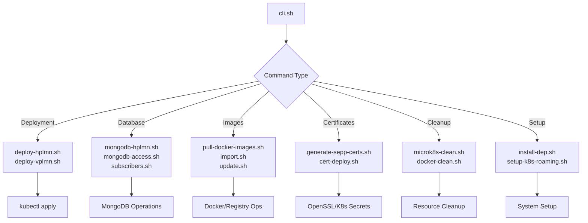

# Scripts and CLI Reference Guide

This guide provides comprehensive documentation for all scripts and CLI commands in the Open5GS roaming deployment project. Understanding these tools will help you customize, troubleshoot, and extend the deployment.

## 📋 Table of Contents

- [CLI Overview](#cli-overview)
- [Core Management Scripts](#core-management-scripts)
- [Deployment Scripts](#deployment-scripts)
- [Database Management Scripts](#database-management-scripts)
- [Certificate Management Scripts](#certificate-management-scripts)
- [Image Management Scripts](#image-management-scripts)
- [Cleanup Scripts](#cleanup-scripts)
- [Script Architecture](#script-architecture)

---

## 🛠️ CLI Overview

### Main CLI Interface

The `cli.sh` script serves as the unified interface for all operations:

```bash
# View all available commands
./cli.sh help

# Check CLI version
./cli.sh version
```

### CLI Command Structure

```bash
./cli.sh [command] [options]

# Examples:
./cli.sh deploy-hplmn --namespace hplmn
./cli.sh mongodb-access --setup --node-port 30017
./cli.sh subscribers --add-range --start-imsi 001011234567891 --end-imsi 001011234567900
```

### Common CLI Options

| Option | Description | Example |
|--------|-------------|---------|
| `--namespace, -n` | Specify Kubernetes namespace | `-n hplmn` |
| `--tag, -t` | Specify image tag | `-t v2.7.5` |
| `--force, -f` | Skip confirmation prompts | `--force` |
| `--help` | Show help for command | `--help` |

---

## 🏗️ Core Management Scripts

### install-dep.sh

**Purpose**: Install all system dependencies required for Open5GS deployment.

**Location**: `scripts/install-dep.sh`

**What it does**:
1. Installs Docker CE with buildx plugin
2. Installs Git and OpenSSL tools  
3. Builds and installs GTP5G kernel module
4. Configures Docker for non-root use
5. Verifies all installations

**Usage**:
```bash
# Install all dependencies
./cli.sh install-dep

# Direct script execution
scripts/install-dep.sh
```

**Post-installation requirements**:
```bash
# Log out and back in for Docker group changes
# Verify installations:
docker --version
git --version
lsmod | grep gtp5g
```

### setup-k8s-roaming.sh

**Purpose**: Complete automated setup orchestrator that handles the entire deployment process.

**Location**: `scripts/setup-k8s-roaming.sh`

**What it does**:
1. Installs and configures MicroK8s
2. Pulls all required Docker images
3. Generates TLS certificates for SEPP
4. Creates Kubernetes namespaces
5. Deploys certificates as secrets
6. Configures DNS and networking

**Usage**:
```bash
# Complete automated setup
./cli.sh setup-roaming --full-setup

# Direct script execution with version
scripts/setup-k8s-roaming.sh v2.7.5
```

**Configuration**:
- Default Open5GS version: `v2.7.5`
- Namespaces created: `hplmn`, `vplmn`
- Certificates stored in: `scripts/cert/open5gs_tls/`

---

## 🚀 Deployment Scripts

### kubectl-deploy-hplmn.sh

**Purpose**: Deploy HPLMN (Home Network) components in the correct dependency order.

**Location**: `scripts/kubectl-deploy-hplmn.sh`

**Deployment Order**:
1. **NRF** (Network Repository Function) - Service registry first
2. **UDR → UDM → AUSF** - User data management chain
3. **SCP** (Service Communication Proxy)
4. **SEPP** (Security Edge Protection Proxy)
5. **MongoDB** (if directory exists)

**Usage**:
```bash
# Deploy HPLMN components
./cli.sh deploy-hplmn

# Direct script execution
scripts/kubectl-deploy-hplmn.sh
```

**What each step does**:
```bash
# 1. Creates namespace if not exists
microk8s kubectl create namespace hplmn --dry-run=client -o yaml | microk8s kubectl apply -f -

# 2. Deploys each component (example for NRF):
cd k8s-roaming/hplmn/nrf/
microk8s kubectl apply -f configmap.yaml -n hplmn    # Configuration
microk8s kubectl apply -f deployment.yaml -n hplmn   # Pod specification
microk8s kubectl apply -f service.yaml -n hplmn      # Network service

# 3. Waits for all pods to be ready
microk8s kubectl wait --for=condition=ready pods --all --namespace=hplmn --timeout=300s
```

### kubectl-deploy-vplmn.sh

**Purpose**: Deploy VPLMN (Visited Network) components in the correct dependency order.

**Location**: `scripts/kubectl-deploy-vplmn.sh`

**Deployment Order**:
1. **NRF** - Service registry
2. **UDR → UDM → AUSF** - User data management
3. **PCF → BSF → NSSF** - Policy functions
4. **SCP → SEPP → SMF** - Core functions
5. **UPF** - User plane
6. **AMF** - Access and mobility (last)

**Usage**:
```bash
# Deploy VPLMN components
./cli.sh deploy-vplmn

# Direct script execution
scripts/kubectl-deploy-vplmn.sh
```

**Why deployment order matters**:
- **NRF must be first**: Other services register with NRF
- **Data services before policy**: UDM/UDR provide data for policy decisions
- **Core functions before access**: SMF/UPF must be ready before AMF starts
- **AMF last**: AMF connects to external RAN, so all internal services must be ready

---

## 🗄️ Database Management Scripts

### mongodb-hplmn.sh

**Purpose**: Deploy MongoDB StatefulSet and Service for HPLMN namespace.

**Location**: `scripts/mongodb-hplmn.sh`

**What it deploys**:
- **StatefulSet**: For persistent MongoDB instances
- **Service**: For internal cluster access and optional NodePort
- **ConfigMap**: For MongoDB configuration (if present)
- **PVC/PV**: For persistent storage (if configured)

**Usage**:
```bash
# Deploy MongoDB for HPLMN
./cli.sh mongodb-hplmn

# Deploy with specific options
./cli.sh mongodb-hplmn --namespace hplmn --force

# Skip waiting for pods to be ready
./cli.sh mongodb-hplmn --no-wait
```

**Configuration options**:
```bash
# Default values in the script
NAMESPACE="hplmn"
STORAGE_SIZE="1Gi"
CONFIG_STORAGE="500Mi"
STORAGE_CLASS="microk8s-hostpath"
```

### mongodb-access.sh

**Purpose**: Manage external access to MongoDB running in Kubernetes.

**Location**: `scripts/mongodb-access.sh`

**Operations**:
- **Setup**: Create NodePort service for external access
- **Remove**: Remove NodePort service
- **Status**: Show connection status and details
- **Port Forward**: Start kubectl port forwarding (temporary)
- **Test**: Test connectivity to MongoDB

**Usage**:
```bash
# Setup external access
./cli.sh mongodb-access --setup

# Check connection status
./cli.sh mongodb-access --status

# Remove external access
./cli.sh mongodb-access --remove

# Test connectivity
./cli.sh mongodb-access --test

# Custom port
./cli.sh mongodb-access --setup --node-port 31017
```

**Output example**:
```bash
MongoDB External Access Status
================================
VM IP Address: 192.168.1.100
NodePort Service: Active
External Port: 30017
Connection String: mongodb://192.168.1.100:30017

Connection Examples:
MongoDB Compass: mongodb://192.168.1.100:30017
MongoDB Shell:   mongo --host 192.168.1.100 --port 30017
Python:          mongodb://192.168.1.100:30017
```

### subscribers.sh

**Purpose**: Comprehensive subscriber management for the 5G core network database.

**Location**: `scripts/subscribers.sh`

**Operations**:
- **Add Single**: Add individual subscriber with IMSI
- **Add Range**: Add multiple subscribers with IMSI range
- **List All**: Display all subscribers in database
- **Count**: Show total number of subscribers
- **Delete All**: Remove all subscribers (with confirmation)

**Usage**:
```bash
# Add single subscriber
./cli.sh subscribers --add-single --imsi 001011234567891

# Add range of subscribers
./cli.sh subscribers --add-range --start-imsi 001011234567891 --end-imsi 001011234567900

# Add with custom authentication keys
./cli.sh subscribers --add-single --imsi 001011234567891 --key "CUSTOM_KEY" --opc "CUSTOM_OPC"

# List all subscribers
./cli.sh subscribers --list-subscribers

# Count subscribers
./cli.sh subscribers --count-subscribers

# Delete all subscribers
./cli.sh subscribers --delete-all
```

**Batch processing features**:
- Processes subscribers in configurable batches (default: 10)
- Shows progress indicators for large ranges
- Efficient bulk operations for better performance
- Input validation for IMSI format (15 digits)

**Subscriber document structure**:
```javascript
{
  "schema_version": NumberInt(1),
  "imsi": "001011234567891",
  "slice": [{
    "sst": NumberInt(1),
    "sd": "000001",
    "default_indicator": true,
    "session": [{
      "name": "internet",
      "type": NumberInt(3),
      "qos": {"index": NumberInt(9)},
      "ambr": {
        "downlink": {"value": NumberInt(1), "unit": NumberInt(3)},
        "uplink": {"value": NumberInt(1), "unit": NumberInt(3)}
      }
    }]
  }],
  "security": {
    "k": "7F176C500D47CF2090CB6D91F4A73479",
    "opc": "3D45770E83C7BBB6900F3653FDA6330F",
    "amf": "8000",
    "sqn": NumberLong(1184)
  }
}
```

---

## 🔐 Certificate Management Scripts

### generate-sepp-certs.sh

**Purpose**: Generate TLS certificates for SEPP N32 interfaces between HPLMN and VPLMN.

**Location**: `scripts/cert/generate-sepp-certs.sh`

**Certificates generated**:
- **CA Certificate**: Root certificate authority
- **HPLMN N32-C**: `sepp1.5gc.mnc001.mcc001.3gppnetwork.org`
- **HPLMN N32-F**: `sepp2.5gc.mnc001.mcc001.3gppnetwork.org`
- **VPLMN N32-C**: `sepp1.5gc.mnc070.mcc999.3gppnetwork.org`
- **VPLMN N32-F**: `sepp2.5gc.mnc070.mcc999.3gppnetwork.org`

**Usage**:
```bash
# Generate certificates
./cli.sh generate-certs

# Direct script execution
scripts/cert/generate-sepp-certs.sh
```

**Certificate details**:
- **Validity**: 365 days
- **Algorithm**: RSA 2048-bit
- **Hash**: SHA-256
- **Output directory**: `scripts/cert/open5gs_tls/`

### cert-deploy.sh

**Purpose**: Deploy TLS certificates as Kubernetes secrets in both namespaces.

**Location**: `scripts/cert-deploy.sh`

**Secrets created**:
- `sepp-n32c`: N32-C interface certificates
- `sepp-n32f`: N32-F interface certificates  
- `sepp-ca`: Certificate Authority certificate

**Usage**:
```bash
# Deploy certificates as secrets
./cli.sh deploy-certs

# Direct script execution
scripts/cert-deploy.sh
```

**What it does**:
```bash
# Creates TLS secrets for HPLMN
microk8s kubectl create secret tls sepp-n32c \
    --cert=scripts/cert/open5gs_tls/sepp-hplmn-n32c.crt \
    --key=scripts/cert/open5gs_tls/sepp-hplmn-n32c.key \
    -n hplmn

# Creates CA secret
microk8s kubectl create secret generic sepp-ca \
    --from-file=ca.crt=scripts/cert/open5gs_tls/ca.crt \
    -n hplmn

# Repeats for VPLMN namespace
```

---

## 📦 Image Management Scripts

### pull-docker-images.sh

**Purpose**: Pull all Open5GS component images from a Docker registry.

**Location**: `scripts/pull-docker-images.sh`

**Images pulled**:
- All Open5GS components (AMF, SMF, UPF, NRF, etc.)
- Utility images (tcpdump, netshoot, MongoDB)

**Usage**:
```bash
# Pull images with default version
./cli.sh pull-images

# Pull specific version
./cli.sh pull-images -t v2.7.5

# Direct script execution
scripts/pull-docker-images.sh v2.7.5
```

**Default image list**:
```bash
COMPONENTS=(
  "base-open5gs"
  "amf" "ausf" "bsf" "nrf" "nssf" "pcf"
  "scp" "sepp" "smf" "udm" "udr" "upf" "webui"
)

# Utility images
UTIL_IMAGES=(
  "corfr/tcpdump"
  "nicolaka/netshoot:latest"
  "mongo:4.4"
)
```

### import.sh

**Purpose**: Import Docker images into MicroK8s registry for air-gapped deployments.

**Location**: `scripts/import.sh`

**Usage**:
```bash
# Import images to MicroK8s registry
./cli.sh import-images

# Direct script execution
scripts/import.sh
```

**What it does**:
1. Enables MicroK8s registry if not enabled
2. Tags images for local registry (`localhost:32000/`)
3. Pushes images to MicroK8s registry
4. Lists imported images for verification

### update.sh

**Purpose**: Update Kubernetes deployment manifests to use custom registry.

**Location**: `scripts/update.sh`

**Usage**:
```bash
# Update configs for MicroK8s registry
./cli.sh update-configs

# Direct script execution
scripts/update.sh
```

**What it does**:
```bash
# Updates image references in deployment files
find k8s-roaming/ -name "*.yaml" -type f -exec sed -i \
    's|image: docker.io/vinch05/|image: localhost:32000/|g' {} \;

# Sets imagePullPolicy to IfNotPresent
sed -i "/image: localhost:32000/a \        imagePullPolicy: IfNotPresent" file.yaml
```

---

## 🧹 Cleanup Scripts

### microk8s-clean.sh

**Purpose**: Clean all Kubernetes resources from specified namespace.

**Location**: `scripts/microk8s-clean.sh`

**Resources cleaned**:
- Deployments and StatefulSets
- Services and ConfigMaps
- PersistentVolumeClaims
- Pods and Secrets
- Optional: PersistentVolumes

**Usage**:
```bash
# Clean specific namespace
./cli.sh clean-k8s -n hplmn

# Clean with persistent volumes
./cli.sh clean-k8s -n hplmn --delete-pv

# Force clean without confirmation
./cli.sh clean-k8s -n hplmn --force
```

**Safety features**:
- Confirmation prompt before deletion
- Counts resources before deletion
- Graceful termination with timeouts
- Option to preserve or delete persistent volumes

### docker-clean.sh

**Purpose**: Clean all Docker containers and images related to Open5GS.

**Location**: `scripts/docker-clean.sh`

**What it cleans**:
- All Open5GS containers (running and stopped)
- All Open5GS images
- Optional: Dangling images and volumes

**Usage**:
```bash
# Clean Docker resources
./cli.sh clean-docker

# Force clean without confirmation
./cli.sh clean-docker --force
```

**Safety features**:
- Shows resources before deletion
- Confirmation prompt
- Option to clean dangling images
- Preserves non-Open5GS containers/images

---

## 🏗️ Script Architecture

### CLI Command Flow



### Error Handling

All scripts implement consistent error handling:

```bash
# Exit on error
set -e

# Color-coded output
GREEN='\033[0;32m'
RED='\033[0;31m'
YELLOW='\033[1;33m'
NC='\033[0m'

# Error function
handle_error() {
    echo -e "${RED}Error: $1${NC}"
    exit 1
}

# Success function  
success() {
    echo -e "${GREEN}Success: $1${NC}"
}
```

### Common Functions

Several scripts share common utilities:

```bash
# Check if script exists and is executable
check_script() {
    local script_path=$1
    if [ ! -f "$script_path" ]; then
        echo "Error: Script not found"
        return 1
    fi
}

# Get MongoDB pod name
get_mongodb_pod() {
    local pod_name=$(microk8s kubectl get pods -n hplmn -l app=mongodb -o jsonpath='{.items[0].metadata.name}')
    echo $pod_name
}

# Validate IMSI format
validate_imsi() {
    local imsi=$1
    if [[ ! $imsi =~ ^[0-9]{15}$ ]]; then
        echo "Error: IMSI must be exactly 15 digits"
        return 1
    fi
}
```

### Configuration Management

Scripts use environment variables and defaults:

```bash
# Default values
NAMESPACE="hplmn"
VERSION="v2.7.5"
BATCH_SIZE=10
NODE_PORT="30017"

# Parse command line arguments
while [[ $# -gt 0 ]]; do
    case $1 in
        --namespace|-n)
            NAMESPACE="$2"
            shift 2
            ;;
        --tag|-t)
            VERSION="$2"
            shift 2
            ;;
        *)
            echo "Unknown argument: $1"
            exit 1
            ;;
    esac
done
```

---

## 📚 Script Development Guidelines

### Creating New Scripts

1. **Follow naming convention**: `action-target.sh` (e.g., `deploy-hplmn.sh`)
2. **Use consistent error handling**: Exit on error, color-coded output
3. **Add help documentation**: Usage function with examples
4. **Implement argument parsing**: Support standard options
5. **Add to CLI**: Register in `cli.sh` for consistency

### Script Template

```bash
#!/bin/bash
# Script Name and Purpose
# This script does [specific function]

set -e

# Color codes for output
GREEN='\033[0;32m'
BLUE='\033[0;34m'
RED='\033[0;31m'
YELLOW='\033[1;33m'
NC='\033[0m'

# Default values
DEFAULT_VALUE="default"

# Function to show usage
show_usage() {
    echo "Usage: $0 [OPTIONS]"
    echo "Options:"
    echo "  --option VALUE    Description"
    echo "  --help           Show this help"
}

# Main function
main() {
    echo -e "${BLUE}Starting [script purpose]...${NC}"
    # Script logic here
    echo -e "${GREEN}Completed successfully${NC}"
}

# Parse arguments
while [[ $# -gt 0 ]]; do
    case $1 in
        --help)
            show_usage
            exit 0
            ;;
        *)
            echo -e "${RED}Unknown argument: $1${NC}"
            show_usage
            exit 1
            ;;
    esac
done

# Run main function
main "$@"
```

---

## 🔗 Related Documentation

- **[← Back to Main README](../README.md)**
- **[Setup Guide](SETUP.md)** - For deployment instructions  
- **[Docker Guide](DOCKER.md)** - For container management
- **[Kubernetes Guide](KUBERNETES.md)** - For K8s-specific configurations
- **[Troubleshooting Guide](TROUBLESHOOTING.md)** - For debugging help